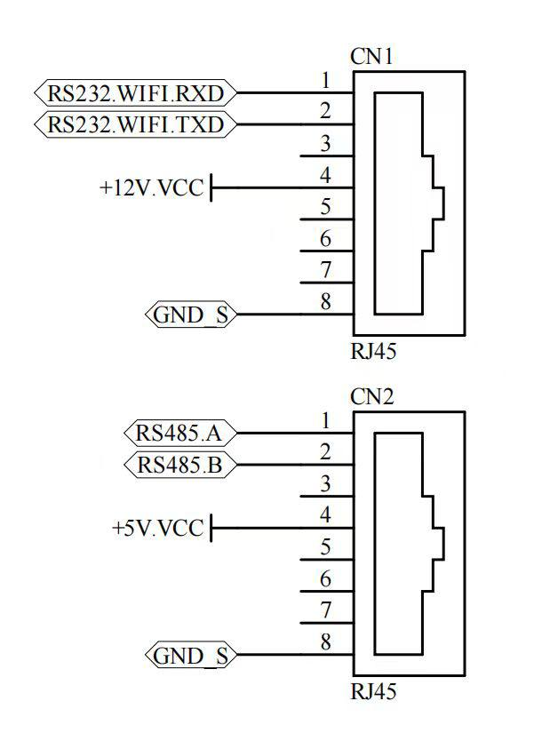
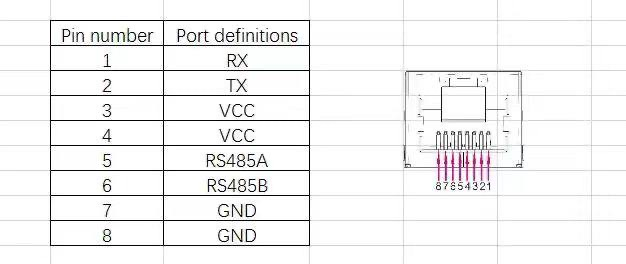

# TTN‑TECO‑6.2 kW Dongle for Inverter Monitoring

This project is a hardware & software dongle designed to connect to the TTN TECO 6.2 kW inverter via RS‑232 using the ESP32‑C3 SuperMini board.

## 🔧 Components

| Component          | Description                           | Link |
|-------------------|----------------------------------------|------|
| ESP32‑C3 SuperMini | Main controller with Wi‑Fi           | [Link](https://www.aliexpress.com/item/1005007479144456.html) |
| RS‑232 ↔ TTL MAX3232 | Level converter—it shifts RS‑232 to TTL voltage | [Link](https://www.aliexpress.com/item/4000370825055.html) |
| DC‑DC Converter     | Step‑down 12–24 V → 5 V / 3 A         | [Link](https://www.aliexpress.com/item/1005007092498838.html) |




## ⚙️ Purpose

The dongle lets you:

- Read data from the TTN‑TECO inverter via UART/RS‑232;
- Send data to Home Assistant via ESPHome;
- Monitor energy consumption locally or in the cloud.

## 🛠 Wiring

1. **Power:**
   - Supply 12–24 V to the DC‑DC converter input;
   - Connect the 5 V output to the ESP32‑C3.

2. **Communication:**
   - Connect inverter TX/RX (RS‑232) to the MAX3232 converter;
   - Wire MAX3232 TTL output to ESP32‑C3 UART (recommended: RX = GPIO20, TX = GPIO21 or other available pins).

3. **Flashing the firmware:**
   - Use the ESPHome project (see below);
   - Flash via `USB‑UART` adapter or OTA.

## 📦 Firmware

Firmware is built on ESPHome and provides:

- Automatic data reading via the `QPIGS` command;
- Sensor integration with Home Assistant;
- Optional MQTT support;
- Optional live data web interface.

Implementation details in the `custom_components/solar_inverter` directory.

## 🧾 Sample `ttn‑inverter.yaml`

```yaml
substitutions:
  name: ttn-inverter
  inv_id: ttn-inverter
  device_description: "Hybrid inverter via MAX communication"
  external_components_source: github://srepenko/esphome-solar-inverter@main

esphome:
  name: ${name}
  comment: ${device_description}
  min_version: 2024.6.0
  platformio_options:
    board_build.f_flash: 40000000L
    board_build.flash_mode: dio
    board_build.flash_size: 4MB

esp32:
  variant: ESP32C3
  board: seeed_xiao_esp32c3
  framework:
    type: arduino
...

external_components:
  - source: ${external_components_source}
    refresh: 0s

uart:
  id: uart_bus
  tx_pin: GPIO21
  rx_pin: GPIO20
  baud_rate: 2400

solar_inverter:
  uart_id: uart_bus
